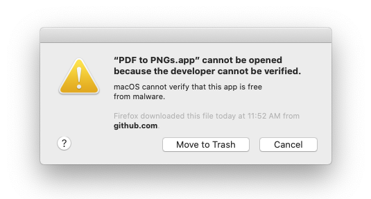
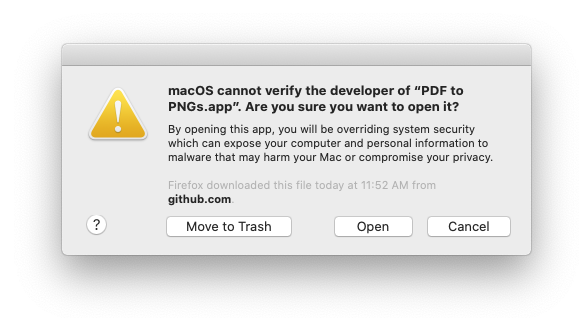

# PDF to PNGs

A macOS Automator app &amp; workflow for converting a PDF with to 300dpi PNG files.

This is handy for when you have a multi-page PDF file and you need PNG files for some other purpose.

---

Download and unzip everything.

---

After you unzip `PDF to PNGs.app.zip` you can right-click and select `Open`

You'll probably see the following:

---

Click `Cancel` and the do it again and you should be able to open it the second time.

(The application is not registered with Apple because they demand money for such priviledges.)

---

Alternately unzip the `PDF to PNGs.workflow.zip` file and just open that in Automator.app in macOS.

From there you can run it, change it, or export it as your own application.

